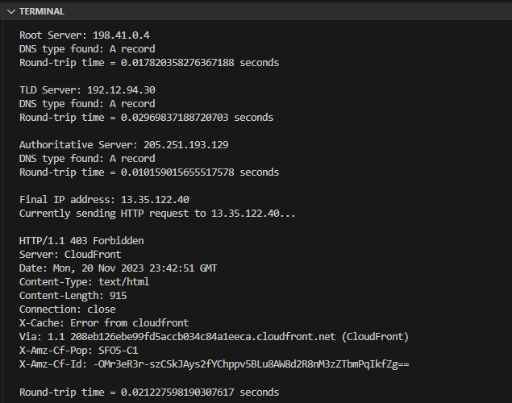

# Optimized DNS Resolver
A high-performance DNS resolver implemented from scratch to resolve IPv4 addresses from hostnames. Includes timeout handling and built-in round-trip time calculations to measure performance.

## Resolving IPv4 addresses
### Instructions
- Run ``DNSClient.py``

### Explanation
The DNS packet is created under create_query() and is composed of a header and query. The header includes query information such as the transaction ID and expected number of questions/responses which is required to parse the response message. The query section includes the type and class information which enables us to retrieve the associated IPv4 address for the given example, tmz.com.

Reading the responses involves using the stored header and query information to parse the data due to the use of compression techniques to reduce message sizes, such as pointers and offset. Retrieving data from the responses also requires looking through additional records and decoding addresses from hexadecimal to decimal format before sending out further DNS packets.

The initial packet is sent to the root DNS server. The received IP address is then used to reach the TLD server which is used to reach the Authoritative server, until the IP address for tmz.com is received.

### Expected output
